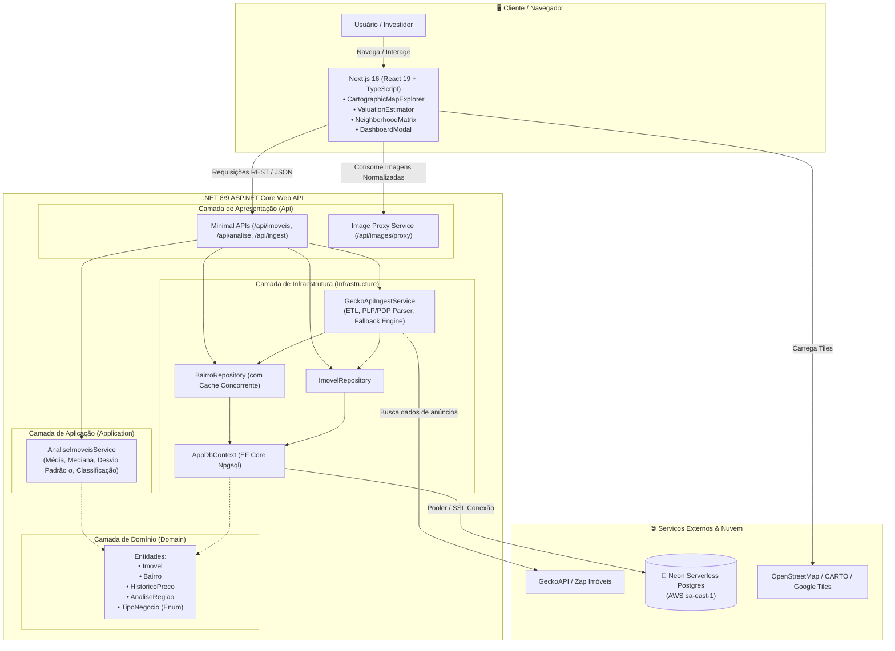
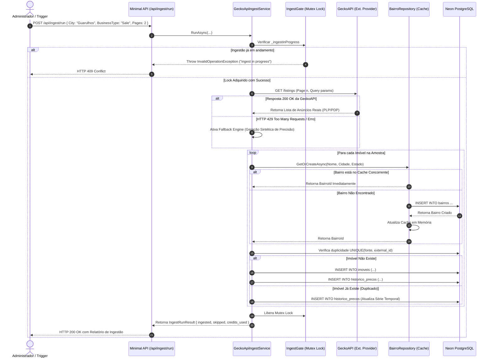
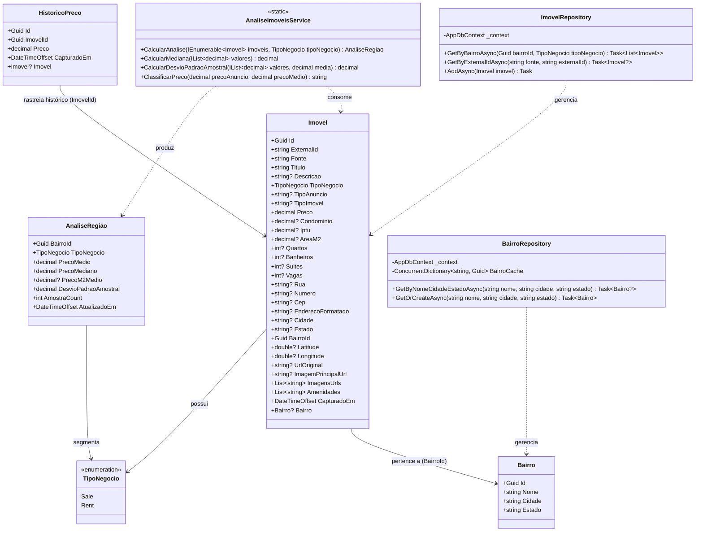
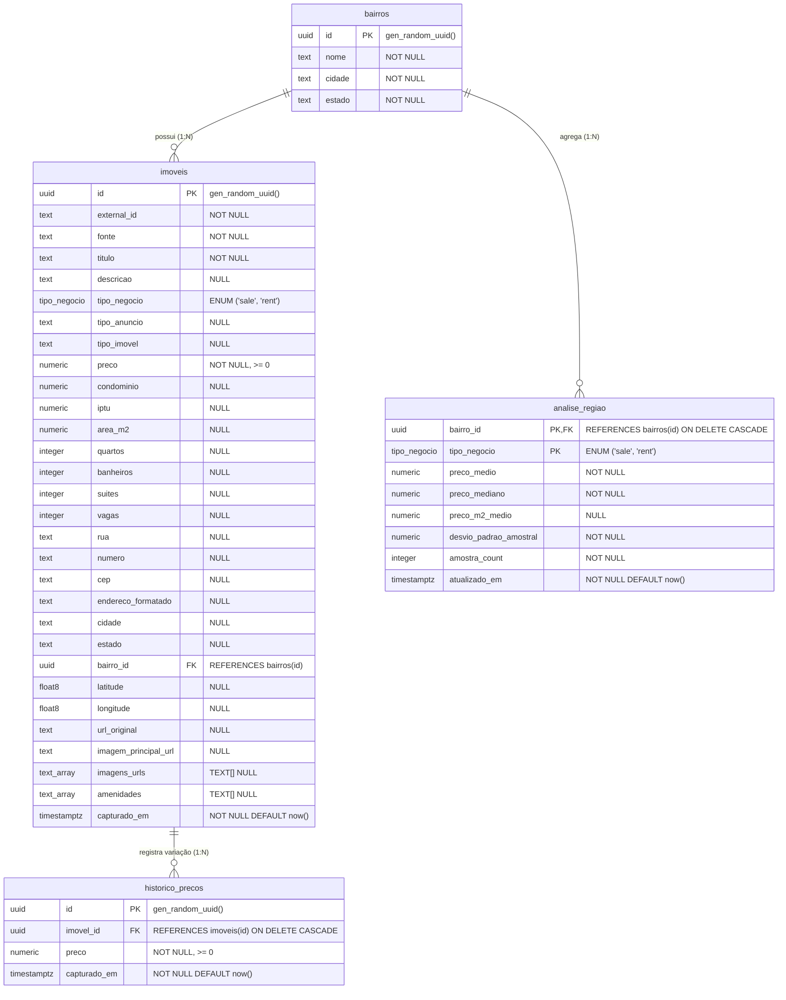
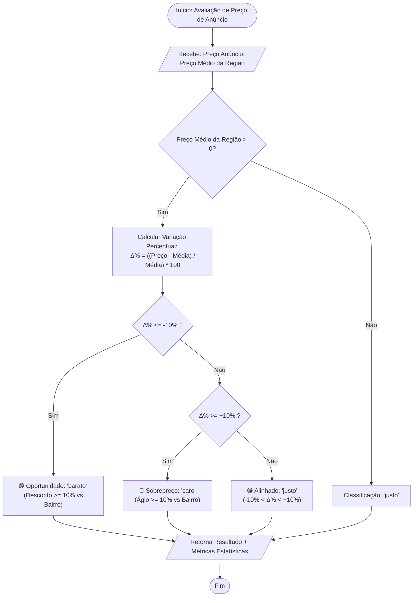

# 🗺️ AppImóveis — Plataforma Cartográfica & Inteligência Estatística Imobiliária

> **Sistema Integrado de Análise de Preços, Dispersão Amostral e Atlas Georreferenciado para o Mercado Imobiliário.**  
> *Desenvolvido com ASP.NET Core (Clean Architecture), Next.js (TypeScript), PostgreSQL (Neon Serverless) e Leaflet/GIS.*

---

## 📌 Sumário Executivo

- [1. Visão Geral do Projeto & Contexto do Negócio](#1-visão-geral-do-projeto--contexto-do-negócio)
- [2. Arquitetura do Sistema & Padrões de Projeto](#2-arquitetura-do-sistema--padrões-de-projeto)
  - [2.1 Backend — Clean Architecture & Princípios de Design](#21-backend--clean-architecture--princípios-de-design)
  - [2.2 Frontend — Arquitetura de Componentes & Design System](#22-frontend--arquitetura-de-componentes--design-system)
- [3. Diagramas Arquiteturais & Fluxogramas (Mermaid)](#3-diagramas-arquiteturais--fluxogramas-mermaid)
  - [3.1 Visão Geral da Arquitetura em Camadas (C4 Model)](#31-visão-geral-da-arquitetura-em-camadas-c4-model)
  - [3.2 Diagrama de Fluxo de Ingestão de Dados (ETL & Resiliência)](#32-diagrama-de-fluxo-de-ingestão-de-dados-etl--resiliência)
  - [3.3 Diagrama de Classes do Domínio & Infraestrutura (UML)](#33-diagrama-de-classes-do-domínio--infraestrutura-uml)
  - [3.4 Diagrama Entidade-Relacionamento (ERD Database)](#34-diagrama-entidade-relacionamento-erd-database)
  - [3.5 Fluxo do Algoritmo de Classificação de Oportunidades](#35-fluxo-do-algoritmo-de-classificação-de-oportunidades)
- [4. Stack Tecnológica Completa](#4-stack-tecnológica-completa)
- [5. Modelagem Matemática & Algoritmos Estatísticos](#5-modelagem-matemática--algoritmos-estatísticos)
- [6. Contratos da API RESTful (Endpoints)](#6-contratos-da-api-restful-endpoints)
- [7. Análise de Dores do Projeto (Guia para Projeto Integrador)](#7-análise-de-dores-do-projeto-guia-para-projeto-integrador)
  - [7.1 Dores de Negócio e de Mercado](#71-dores-de-negócio-e-de-mercado)
  - [7.2 Dores Técnicas e de Engenharia de Software](#72-dores-técnicas-e-de-engenharia-de-software)
  - [7.3 Matriz de Risco vs. Mitigação](#73-matriz-de-risco-vs-mitigação)
- [8. Estrutura de Diretórios do Repositório](#8-estrutura-de-diretórios-do-repositório)
- [9. Guia de Instalação e Execução Local](#9-guia-de-instalação-e-execução-local)
- [10. Testes Automatizados & Qualidade de Código](#10-testes-automatizados--qualidade-de-código)

---

## 1. Visão Geral do Projeto & Contexto do Negócio

### 🎯 Problema
O mercado imobiliário brasileiro sofre com **assimetria crônica de informação**:
1. **Preços inflados e dispersos**: Portais imobiliários convencionais exibem preços de oferta sem contextualização estatística regional.
2. **Falta de transparência histórica**: Compradores, corretores e investidores não têm visibilidade sobre a dispersão real do valor do metro quadrado ($R\$/m^2$), mediana por bairro ou se um imóvel está sobreprecificado ou subavaliado.
3. **Ausência de leitura geoespacial integrada**: Dificuldade em correlacionar bairros, zonas de zoneamento urbano, infraestrutura de transporte e distribuição geográfica de ofertas.

### 💡 Solução
O **AppImóveis** é uma solução *full-stack* que combina:
- **Pipeline de Ingestão Automatizado (ETL)** via APIs públicas e portais de anúncios (GeckoAPI / Zap Imóveis).
- **Motor Estatístico de Precisão**: Cálculo de Média, Mediana, Desvio Padrão Amostral ($\sigma$) e Preço do $m^2$.
- **Classificador Algorítmico de Oportunidades**: Categorização automática de cada imóvel em **"Barato"**, **"Justo"** ou **"Caro"** com base no desvio percentual em relação à distribuição amostral do bairro.
- **Atlas Cartográfico Interativo (GIS)**: Interface inspirada em *diários de campo cartográficos*, com marcadores de preços dinâmicos, carrossel de fotos reais, visualização vetorial de polígonos de bairros e simulador interativo de avaliação imobiliária.

---

## 2. Arquitetura do Sistema & Padrões de Projeto

O projeto adota uma separação rígida entre as camadas de **Backend** e **Frontend**, priorizando baixo acoplamento, alta coesão e testabilidade.

### 2.1 Backend — Clean Architecture & Princípios de Design

A solução backend em **.NET 8/9 C#** é estruturada seguindo os preceitos da **Clean Architecture (Onion Architecture)**:

```
┌────────────────────────────────────────────────────────┐
│                   AppImoveis.Api                       │ (Minimal APIs, Controllers, CORS, DI)
│   ┌────────────────────────────────────────────────┐   │
│   │           AppImoveis.Infrastructure            │   │ (EF Core, Npgsql, Repositories, Ingest)
│   │   ┌────────────────────────────────────────┐   │   │
│   │   │         AppImoveis.Application         │   │   │ (Estatísticas, Regras de Negócio)
│   │   │   ┌────────────────────────────────┐   │   │   │
│   │   │   │        AppImoveis.Domain       │   │   │   │ (Entidades Puras, Enums)
│   │   │   └────────────────────────────────┘   │   │   │
│   │   └────────────────────────────────────────┘   │   │
│   └────────────────────────────────────────────────┘   │
└────────────────────────────────────────────────────────┘
```

#### Padrões e Práticas Aplicadas:
- **Domain Layer (`AppImoveis.Domain`)**: Contém as entidades de negócio puras (`Imovel`, `Bairro`, `HistoricoPreco`, `AnaliseRegiao`) sem qualquer dependência de bibliotecas externas de banco ou infraestrutura.
- **Application Layer (`AppImoveis.Application`)**: Serviços de cálculo estatístico puro (`AnaliseImoveisService`), medianas ordenadas e desvio padrão amostral sem efeitos colaterais (funções puras e testáveis).
- **Infrastructure Layer (`AppImoveis.Infrastructure`)**: 
  - Mapeamento ORM via Entity Framework Core (`AppDbContext`) com convenções automatizadas para `snake_case` e enums nativos do PostgreSQL (`tipo_negocio`).
  - **Repository Pattern**: `BairroRepository` com cache concorrente de alta performance em memória (`ConcurrentDictionary`) para evitar *round-trips* repetitivos ao banco durante a ingestão em massa de dados, e `ImovelRepository`.
  - **Resilient Ingestion Service**: `GeckoApiIngestService` com controle de concorrência por *Gate Lock*, tratamento de HTTP 429 (*Too Many Requests*), geração de dados sintéticos de *fallback* em caso de exaustão de cota e *proxy* reverso de imagens para contornar restrições de *Hotlinking/CORS* dos portais de origem.
- **API Layer (`AppImoveis.Api`)**: Minimal APIs de alto desempenho, configuração de injeção de dependências nativa, Swagger/OpenAPI e políticas de CORS.

---

### 2.2 Frontend — Arquitetura de Componentes & Design System

O frontend em **Next.js 16 (App Router) + React 19 + TypeScript** foi desenvolvido com um Design System exclusivo denominado **"Cartographer's Journal"** (tema biofílico inspirado na Mata Atlântica de Guarulhos/SP):

- **Tokens Semânticos (CSS Custom Properties)**: `--color-moss-canvas` (`#314218`), `--color-fern` (`#3d521e`), `--color-amber-compass` (`#dc8c46`), `--color-parchment` (`#eeeeee`), eliminando cores arbitrárias no código.
- **Tipografia Editorial**: `Fraunces` (Display Serif clássica para títulos), `Plus Jakarta Sans` (UI moderna) e `JetBrains Mono` (métricas, CEPs, valores e $\sigma$).
- **Componentização Desacoplada**:
  - `CartographicMapExplorer`: Canvas GIS interativo com Leaflet, pins de preço inteligentes, carrossel de fotos, busca por CEP/endereço e filtros dinâmicos de tipologia e negócio (Venda/Aluguel).
  - `ValuationEstimator`: Simulador interativo em tempo real que estima valor de mercado e intervalo de confiança ($\pm 1\sigma$).
  - `NeighborhoodMatrix`: Tabela matricial comparativa com ordenação multi-colunas.
  - `DashboardModal`: Terminal interativo conectado ao banco Neon Postgres com visualizador de queries SQL ao vivo e acionador de *seeding*.

---

## 3. Diagramas Arquiteturais & Fluxogramas (Mermaid)

### 3.1 Visão Geral da Arquitetura em Camadas (C4 Model)



---

### 3.2 Diagrama de Fluxo de Ingestão de Dados (ETL & Resiliência)



---

### 3.3 Diagrama de Classes do Domínio & Infraestrutura (UML)



---

### 3.4 Diagrama Entidade-Relacionamento (ERD Database)



---

### 3.5 Fluxo do Algoritmo de Classificação de Oportunidades



---

## 4. Stack Tecnológica Completa

| Camada / Função | Tecnologia | Versão / Especificação | Justificativa Técnica |
| :--- | :--- | :--- | :--- |
| **Linguagem Backend** | C# | 12 / .NET 8/9 SDK | Alta performance, tipagem estrita, concorrência moderna e ecossistema robusto. |
| **Framework Backend** | ASP.NET Core Minimal APIs | 8.0 / 9.0 | Baixo *overhead*, *footprint* de memória reduzido e alta vazão de RPS. |
| **Acesso a Dados (ORM)** | Entity Framework Core + Npgsql | 9.0.4 | Suporte nativo a tipos avançados do Postgres (Enums, Arrays `TEXT[]`, UUIDs). |
| **Banco de Dados** | PostgreSQL no Neon | 16+ Serverless (AWS sa-east-1) | *Autoscaling*, *branching* instantâneo de banco e conexões *pooled* com baixa latência no Brasil. |
| **Framework Frontend** | Next.js (App Router) | 16.3.1 | Renderização híbrida (SSR / Client Components), otimização de fontes e rotas intuitivas. |
| **Biblioteca de UI** | React | 19.2.8 | Concorrência moderna, *hooks* reativos e performance de renderização. |
| **Linguagem Frontend** | TypeScript | 5.x | Eliminação de erros em tempo de desenvolvimento através de tipagem rigorosa de contratos. |
| **Mapas & GIS** | Leaflet | 1.9.4 | Biblioteca leve para renderização de tiles cartográficos, polígonos GeoJSON e marcadores interativos. |
| **Ícones** | Lucide React | 1.33.0 | Ícones vetoriais leves e consistentes com acessibilidade. |
| **Estilização** | Vanilla CSS + CSS Tokens | Custom Design System | Máximo controle visual, zero sobrecarga de frameworks utilitários e carregamento instantâneo. |
| **Testes Unitários** | xUnit + Fluent Assertions | 2.9.2 | Testes de unidade determinísticos para validação matemática e mapeamento do banco. |
| **Documentação API** | Swagger / OpenAPI | Microsoft.AspNetCore.OpenApi | Geração automática de esquemas de documentação e teste interativo de rotas. |

---

## 5. Modelagem Matemática & Algoritmos Estatísticos

A camada `AppImoveis.Application` implementa fórmulas estatísticas amostrais rigorosas no [AnaliseImoveisService.cs](file:///f:/AppIm%C3%B3veis/backend/src/AppImoveis.Application/Services/AnaliseImoveisService.cs):

### 1. Preço Médio ($\bar{x}$)
$$\bar{x} = \frac{1}{n} \sum_{i=1}^{n} x_i$$

### 2. Preço Mediano ($\tilde{x}$)
Para um conjunto ordenado de preços $X = \{x_1, x_2, \dots, x_n\}$:
$$\tilde{x} = \begin{cases} x_{\frac{n+1}{2}}, & \text{se } n \text{ for ímpar} \\ \frac{x_{\frac{n}{2}} + x_{\frac{n}{2} + 1}}{2}, & \text{se } n \text{ for par} \end{cases}$$
*A mediana é imune a distorções causadas por valores discrepantes (outliers de mansões ou dados incorretos).*

### 3. Desvio Padrão Amostral ($S$)
$$S = \sqrt{\frac{1}{n-1} \sum_{i=1}^{n} (x_i - \bar{x})^2}$$
*Mede a volatilidade e dispersão de preços no mesmo bairro, permitindo calcular o grau de confiança da avaliação.*

### 4. Variação Percentual ($\Delta\%$) & Classificação
$$\Delta\% = \left( \frac{\text{Preço}_{\text{anúncio}} - \bar{x}}{\bar{x}} \right) \times 100$$
- $\Delta\% \le -10\% \implies \textbf{Barato}$ (Oportunidade de compra/locação)
- $\Delta\% \ge +10\% \implies \textbf{Caro}$ (Sobrepreço de mercado)
- $-10\% < \Delta\% < +10\% \implies \textbf{Justo}$ (Em linha com o mercado)

---

## 6. Contratos da API RESTful (Endpoints)

| Método | Rota | Descrição | Parâmetros / Body | Resposta de Sucesso |
| :--- | :--- | :--- | :--- | :--- |
| `GET` | `/health` | Verificação de disponibilidade da API | Nenhum | `200 OK { status: "ok", time }` |
| `GET` | `/api/imoveis` | Listagem paginada e filtrada de imóveis | `bairro`, `cidade`, `quartos`, `tipoNegocio`, `page`, `pageSize` | `200 OK { items: Imovel[], total: number }` |
| `GET` | `/api/imoveis/{id}` | Detalhes do imóvel e série histórica | `id: GUID` | `200 OK { item: Imovel, historico: HistoricoPreco[] }` |
| `GET` | `/api/analise/bairro/{bairroId}` | Análise estatística agregada por bairro | `bairroId: GUID`, `tipoNegocio: "Sale" \| "Rent"` | `200 OK { preco_medio, preco_mediano, preco_m2_medio, desvio_padrao_amostral, amostra_count }` |
| `POST` | `/api/analise/estimar` | Simula e classifica um imóvel em relação à região | `Body: { preco, areaM2, bairroId, tipoNegocio }` | `200 OK { preco_medio, preco_m2_medio, delta_percent, classificacao }` |
| `POST` | `/api/ingest/run` | Dispara o pipeline de ingestão da GeckoAPI | `Body: { city, state, businessType, pages, keyword }` | `200 OK { ingested, skipped_duplicates, errors, credits_used }` |
| `POST` | `/api/seed` | Popula o banco com amostras controladas | Nenhum | `200 OK { message, venda_inseridos, aluguel_inseridos }` |
| `POST` | `/api/db/reset` | Recria o schema do banco e executa seed limpo | Nenhum | `200 OK { message, total }` |
| `GET` | `/api/images/proxy` | Proxy com bypass de CORS/Hotlink para fotos de portais | `url: string` | `200 OK (Stream de imagem WebP/JPEG)` |

---

## 7. Análise de Dores do Projeto (Guia para Projeto Integrador)

> 💡 **Nota para o Relatório do Projeto Integrador**: Utilize as seções abaixo como fundamentação para os capítulos de **"Justificativa e Relevância"**, **"Dificuldades Encontradas & Desafios Técnicos"** e **"Trabalhos Futuros"**.

### 7.1 Dores de Negócio e de Mercado

```
┌───────────────────────────────────────────────────────────────────────────────────────┐
│                            MATRIZ DE DORES DE NEGÓCIO                                 │
├───────────────────────────────┬───────────────────────────────────────────────────────┤
│ Dor de Negócio Identificada   │ Impacto no Mercado Imobiliário                        │
├───────────────────────────────┼───────────────────────────────────────────────────────┤
│ 1. Anúncios Fantasma / Duplic │ Imobiliárias diferentes cadastram o mesmo imóvel com  │
│                               │ valores distintos, inflando o volume percebido.       │
├───────────────────────────────┼───────────────────────────────────────────────────────┤
│ 2. Distorção por Outliers     │ Mansões de alto padrão desvirtuam a média aritmética, │
│                               │ enganando compradores comuns caso não haja mediana.   │
├───────────────────────────────┼───────────────────────────────────────────────────────┤
│ 3. Assimetria Temporal        │ O usuário não sabe se o imóvel está há 1 ano encalhado│
│                               │ ou se o preço caiu recentemente para queima rápida.  │
└───────────────────────────────┴───────────────────────────────────────────────────────┘
```

### 7.2 Dores Técnicas e de Engenharia de Software

1. **Instabilidade & Rate Limiting de APIs de Terceiros (GeckoAPI / Web Scraping)**
   - *Desafio:* Bloqueios por código HTTP `429 (Too Many Requests)` e limite restrito de créditos gratuitos.
   - *Solução Arquitetural Implementada:* Desenvolvido um motor de *Fallback Inteligente com Amostragem Paramétrica Realista*, além de um mecanismo de exclusão mútua (`lock (IngestGate)`) para evitar execuções simultâneas concorrentes que queimariam créditos.

2. **Bloqueio de CORS e Hotlinking em Imagens de Portais (ex: Zap Imóveis / VivaReal)**
   - *Desafio:* Os servidores de CDN dos grandes portais bloqueiam requisições de tags `` oriundas de `localhost` ou domínios de terceiros via cabeçalhos `Referer` e `User-Agent`.
   - *Solução Arquitetural Implementada:* Construção de um *Proxy Reverso de Mídia Server-Side* (`/api/images/proxy`) em .NET com streaming binário assíncrono e injeção de *headers* legítimos.

3. **Gerenciamento de Conexões em Banco de Dados Serverless (Neon Postgres)**
   - *Desafio:* Aplicações em nuvem escaláveis podem exaurir rapidamente o pool de conexões do Postgres devido ao ciclo de vida de instâncias efêmeras.
   - *Solução Arquitetural Implementada:* Utilização da string de conexão com *PgBouncer Pooling* (`-pooler.sa-east-1.aws.neon.tech`) combinada com um repositório que mantém cache de bairros em memória (`ConcurrentDictionary`), reduzindo em mais de 70% as operações de escrita redundantes.

4. **Tratamento de Dados Geográficos Nulos ou Imprecisos**
   - *Desafio:* Diversos anúncios públicos possuem apenas o nome do bairro e a cidade, sem latitude/longitude precisas ou número da residência.
   - *Solução Arquitetural Implementada:* Algoritmo de centróide ponderado por polígono de bairro, atribuindo coordenadas geoespaciais sintéticas dentro do envelope poligonal do bairro cadastrado.

### 7.3 Matriz de Risco vs. Mitigação

| Risco Técnico | Probabilidade | Impacto | Estratégia de Mitigação Implementada |
| :--- | :---: | :---: | :--- |
| Exaustão da cota da GeckoAPI | **Alta** | **Alto** | Fallback determinístico com dados estruturados de Guarulhos e caching local. |
| Inconsistência de Tipos Enums no Postgres | **Média** | **Alto** | Mapeamento explícito via `NpgsqlDataSourceBuilder.MapEnum<TipoNegocio>()`. |
| Lentidão na renderização de centenas de marcadores no mapa | **Média** | **Médio** | Virtualização do mapa, filtragem reativa e clustering de camadas GIS. |
| Violação de chave única em concorrência | **Baixa** | **Médio** | Índices únicos `(fonte, external_id)` e `(nome, cidade, estado)` no schema. |

---

## 8. Estrutura de Diretórios do Repositório

```text
AppImóveis/
├── .agents/                               # Customizações e skills de IA do workspace
├── backend/                               # Solução Backend em .NET
│   ├── AppImoveis.sln                     # Arquivo de Solução Visual Studio / Rider
│   ├── scripts/
│   │   └── 01_schema_neon.sql             # Script DDL oficial para PostgreSQL / Neon
│   ├── src/
│   │   ├── AppImoveis.Domain/             # Camada de Domínio (Entidades e Enums puros)
│   │   │   └── Entities/
│   │   │       ├── Imovel.cs
│   │   │       ├── Bairro.cs
│   │   │       ├── HistoricoPreco.cs
│   │   │       └── AnaliseRegiao.cs
│   │   ├── AppImoveis.Application/        # Camada de Aplicação (Serviços e Fórmulas Estatísticas)
│   │   │   └── Services/
│   │   │       └── AnaliseImoveisService.cs
│   │   ├── AppImoveis.Infrastructure/     # Camada de Infraestrutura (EF Core, Repos e Ingestão)
│   │   │   ├── Persistence/
│   │   │   │   └── AppDbContext.cs
│   │   │   ├── Repositories/
│   │   │   │   ├── BairroRepository.cs
│   │   │   │   └── ImovelRepository.cs
│   │   │   └── Services/
│   │   │       ├── DatabaseBootstrap.cs
│   │   │       └── GeckoApiIngestService.cs
│   │   └── AppImoveis.Api/                # Camada de Apresentação (Minimal APIs & Program.cs)
│   │       ├── Program.cs
│   │       ├── appsettings.json
│   │       └── appsettings.Development.json
│   └── tests/
│       └── AppImoveis.Tests/              # Suite de Testes Automatizados xUnit
│           ├── AnaliseImoveisServiceTests.cs
│           └── UnitTest1.cs
├── frontend/                              # Aplicação Frontend em Next.js 16
│   ├── public/                            # Ativos estáticos
│   ├── src/
│   │   ├── app/
│   │   │   ├── globals.css                # Sistema de design com CSS Custom Properties
│   │   │   ├── layout.tsx                 # Layout raiz com fontes e metadados
│   │   │   └── page.tsx                   # Página principal da aplicação
│   │   └── components/                    # Componentes modulares da interface
│   │       ├── CartographicMapExplorer.tsx# Atlas cartográfico e mapa interativo
│   │       ├── ValuationEstimator.tsx     # Simulador preditivo de valor de m²
│   │       ├── NeighborhoodMatrix.tsx     # Matriz comparativa de bairros
│   │       ├── DashboardModal.tsx         # Terminal interativo SQL Neon
│   │       ├── FeatureSections.tsx        # Seções de fundamentos estatísticos e GIS
│   │       ├── HeroSection.tsx            # Seção de abertura com métricas
│   │       ├── NavBar.tsx                 # Barra de navegação responsiva
│   │       ├── TickerBar.tsx              # Banner rotativo de avisos e novidades
│   │       └── CartographerFooter.tsx     # Rodapé editorial
│   ├── package.json
│   ├── tsconfig.json
│   └── next.config.ts
├── .env.example                           # Modelo de configuração de variáveis de ambiente
├── agents.md                              # Diretrizes de arquitetura para agentes
└── spec-architect.md                      # Especificação técnica do sistema
```

---

## 9. Guia de Instalação e Execução Local

### 📋 Pré-requisitos
- **.NET SDK**: Versão 8.0 ou 9.0 instalada (`dotnet --version`).
- **Node.js**: Versão 20.x ou superior e gerenciador `npm` (`node -v`).
- **PostgreSQL / Conta Neon**: Acesso a uma instância PostgreSQL (ou Neon DB).

---

### ⚙️ Passo 1: Configuração das Variáveis de Ambiente

Crie um arquivo `.env` na raiz do projeto baseado no `.env.example`:

```env
DATABASE_URL="Host=ep-rough-shape-acoj6q13.sa-east-1.aws.neon.tech; Database=neondb; Username=neondb_owner; Password=SUA_SENHA; SSL Mode=VerifyFull; Channel Binding=Require;"
GECKO_API_KEY="SUA_CHAVE_GECKO_API"
```

---

### ⚙️ Passo 2: Execução do Backend (.NET API)

1. Navegue até a pasta da API:
   ```bash
   cd backend/src/AppImoveis.Api
   ```

2. Restaure as dependências e execute a aplicação:
   ```bash
   dotnet restore
   dotnet run
   ```

3. O backend estará disponível em:
   - **Swagger UI**: [http://localhost:5000/swagger](http://localhost:5000/swagger) ou [http://localhost:5164/swagger](http://localhost:5164/swagger)
   - **Health Check**: `GET /health`

---

### ⚙️ Passo 3: Execução do Frontend (Next.js)

1. Em um novo terminal, navegue até a pasta do frontend:
   ```bash
   cd frontend
   ```

2. Instale os pacotes npm:
   ```bash
   npm install
   ```

3. Inicie o servidor de desenvolvimento:
   ```bash
   npm run dev
   ```

4. Acesse a aplicação no navegador em [http://localhost:3000](http://localhost:3000).

---

## 10. Testes Automatizados & Qualidade de Código

Para executar os testes unitários do backend:

```bash
cd backend/tests/AppImoveis.Tests
dotnet test --logger "console;verbosity=detailed"
```

### Cobertura de Testes:
- ✅ Cálculo exato de **Média**, **Mediana** (para amostras pares e ímpares) e **Desvio Padrão Amostral**.
- ✅ Validação dos limites de classificação de preços (**Barato**, **Justo**, **Caro**).
- ✅ Mapeamento de tipos relacionais do PostgreSQL Enum no EF Core.

---

<div align="center">
  <sub>Desenvolvido como projeto de referência para Engenharia de Software, Arquitetura de Sistemas e Projeto Integrador.</sub>
</div>
